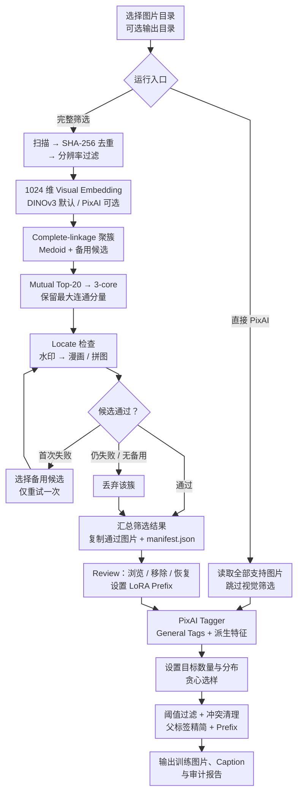

<p align="center">
  
</p>

[English](README_EN.md)

LoRAForge 是一个在本机运行的图片数据集整理工具，用来把杂乱的图片文件夹处理成适合 LoRA 训练的数据集。

它会自动完成图片去重、分辨率过滤、视觉聚类、风格一致性筛选、水印与拼图检测，并提供人工复核界面。复核完成后，软件使用 PixAI Tagger 生成标签、按目标分布选择图片，最后输出训练图片和对应的 Caption 文本。

<p align="center">
  
</p>

## 能做什么
- 删除内容完全相同的重复图片，过滤像素分辨率不足的图片。
- 使用 visual embedding 分析图片相似度。
- 通过聚类和图筛选保留视觉风格一致的主要图片集合。
- 使用 Locate Anything 检测水印、签名、漫画分镜和拼图。
- 在网页中浏览筛选结果，手动移除或恢复图片。
- 使用 PixAI Tagger 生成 general tags。
- 按人数、取景和室内外比例选择最佳数据集配比。
- 清洗不合理的标签、添加 LoRA Prefix，并为每张图片生成 Caption。

## 完整流程



## Pipeline 如何工作

### 1. 扫描、去重与分辨率过滤

扫描所选目录，只读取支持的图片格式。每个文件会计算 SHA-256；内容完全相同的图片只保留一份。

通过去重的图片再按总像素检查分辨率。界面默认要求至少 1 MP，也可以选择兼容 720p 的 921,600 像素门槛。

### 2. Visual Embedding 与聚类

每张图片会转换成一个 1024 维向量。默认模型是 DINOv3，也可以使用 PixAI Tagger 的原生 visual embedding（若数据集中包含现实图片，建议优先选择 DINOv3）。

使用 Complete-linkage 聚类。只有簇内任意两张图片都达到相似度要求时，它们才会留在同一个簇。每个簇会选出一个最能代表该簇的 medoid，并保留其他图片作为检测失败时的备用候选。

### 3. 图筛选

聚类之后，软件使用各簇 medoid 的向量建立 Mutual Top-20 图：两个簇必须互相把对方视为近邻，并达到相似度门槛，才会连接。

图会经过迭代 3-core 清理，再只保留最大的连通分量。这样可以排除与主要数据集风格联系较弱的孤立簇。

### 4. 水印与拼图检测

最大连通分量中的每个簇会先检查 medoid。Locate Anything 依次检测：

1. 水印、作者签名、用户名、网址、Logo 或预览文字。
2. 漫画分镜、对话框、拼图和图片网格。

如果 medoid 不通过，软件会从同一簇中随机选择另一张候选图，只重试一次。通过的图片被复制到输出目录，不通过的簇会记录原因。

### 5. Review

筛选完成后，网页会显示所有通过图片。可以查看大图、移除不合适的图片，或立即撤销移除操作。

确认结果后，输入 LoRA Prefix 并提交，进入 PixAI 标注阶段。

### 6. PixAI 标注、选样与 Caption

PixAI Tagger 为每张图片生成 general tags，并派生三个选样维度：

- 人数：单人、双人、三人及以上。
- 取景：全身、半身、头像。
- 场景：室内或室外。

设置最终图片数量和目标比例后，软件会优先选择能够填补分布缺口的图片。

最终 Caption 会经过置信度过滤、denylist、互斥标签清理、语义冲突处理和父标签精简，再在开头加入 LoRA Prefix。每张训练图片旁边会生成同名 `.txt` 文件。

## 如何使用

### 系统要求

- Apple Silicon Mac（M1 或更新型号），使用原生 arm64 环境。
- macOS 14 或更新版本。
- 当前 Node.js LTS 与 npm，用于构建 TypeScript + React 前端。
- 能够访问 Hugging Face 模型仓库。
- 足够的磁盘空间保存 Python 环境和模型文件。
- 建议至少 16 GB 统一内存；24 GB 或更多更适合同时运行全部模型。

项目固定使用真实本地模型，不提供运行模式切换。

macOS 版本会按模型使用最合适的 Apple 后端：

- Locate Anything：`mlx-community/LocateAnything-3B-4bit`，通过 MLX 使用 Apple GPU。
- DINOv3：通过 PyTorch MPS 使用 Apple GPU，推理精度为 FP16。
- PixAI Tagger：通过 ONNX Runtime CoreML 使用 Apple GPU / Neural Engine，并允许 CoreML 对不支持的算子回退到 CPU。

### 第一次启动

先下载项目：

```bash
git clone https://github.com/Cheolhwi/auto_prepare.git
cd auto_prepare
git switch mac-version
```

然后：

1. 在 Hugging Face 上同意 DINOv3 模型的使用条款。
2. 检查项目根目录中的 `.env`。
3. 如果下载模型需要令牌，在 Terminal 中临时设置：

```bash
export HF_TOKEN="<your-token>"
```

4. 首次运行时赋予脚本执行权限并启动：

```bash
chmod +x start_services.sh stop_services.sh
./start_services.sh
```

启动脚本会确认当前环境是 Apple Silicon，安装并构建 TypeScript + React 前端，自动准备 `uv`、原生 arm64 Python 3.11、项目依赖和模型文件，验证 MLX、MPS 与 CoreML，然后启动：

- 前端：[http://127.0.0.1:5173](http://127.0.0.1:5173)
- 后端：[http://127.0.0.1:8000](http://127.0.0.1:8000)
- Locate Anything：`http://127.0.0.1:9000`

首次下载和加载模型需要较长时间，也需要数 GB 磁盘空间。后续启动会复用已经安装的依赖、模型和健康服务。运行日志与 PID 文件保存在项目的 `.auto-cat-tmp/` 目录中。

由于 PixAI 的 ONNX 工具链需要 NumPy 1.x，而当前 `mlx-vlm` 需要 NumPy 2.x，启动脚本会自动为 Locate Anything 建立隔离的 `mlx_service` 环境，避免两个上游依赖互相覆盖。

### 创建数据集

1. 在网页中选择图片文件夹。
2. 可选：指定输出文件夹。
3. 选择 DINOv3 或 PixAI Embedding，并设置分辨率门槛。
4. 点击“启动流水线”。
5. 在流程面板中查看聚类、图筛选和 Locate 检测进度。
6. 在 Review 中移除不需要的图片。
7. 输入 LoRA Prefix 并提交 PixAI 标注。
8. 设置最终图片数量、目标分布、Caption 阈值和额外 denylist。
9. 完成后在输出目录中获取训练数据集。

如果图片已经整理好，可以使用“直接运行 PixAI”。这个入口会跳过视觉筛选，直接对所选文件夹中的全部图片进行标注、选样和 Caption 生成。

### 停止服务

在 Terminal 中运行：

```bash
./stop_services.sh
```

脚本只会停止由本项目启动并记录 PID 的前端、后端与 Locate Anything 进程。

## 输出内容

完整筛选默认输出到源目录下的 `filtered_dataset_<job_id>`。如果在网页中选择了输出目录，则使用该目录。

```text
filtered_dataset_<job_id>/
├─ 00001_image.png
├─ 00002_image.jpg
├─ manifest.json
├─ pixai_tags.json
└─ training_dataset_<lora_prefix>/
   ├─ 00001_image.png
   ├─ 00001_image.txt
   ├─ 00002_image.jpg
   ├─ 00002_image.txt
   └─ selection_report.json
```

- `manifest.json`：记录图片来源、所属簇、检测结果和输出位置。
- `pixai_tags.json`：保存 PixAI 标签、派生字段、最终选择和 Caption 审计。
- `training_dataset_<lora_prefix>/`：最终训练图片与同名 Caption。
- `selection_report.json`：记录选样目标、实际分布和 Caption 配置。

## 开发检查

```bash
npm ci
npm run typecheck
npm run test:frontend
npm run build
uv run pytest
uv run ruff check .
```

## 开源协议

本项目采用 [Apache License 2.0](LICENSE)。

第三方模型及其权重仍遵循各自的许可证和使用条款，不会因本项目采用 Apache License 2.0 而被重新授权。
