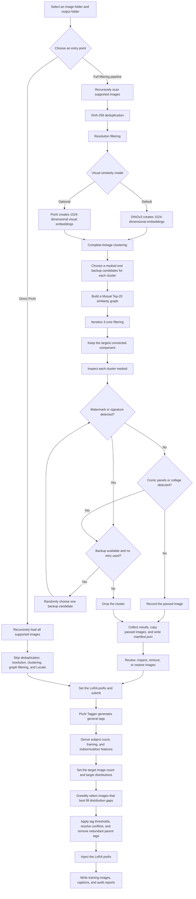

# LoRAForge

[简体中文](README.md)

LoRAForge is a local image-dataset preparation tool that turns an unorganized image folder into a dataset suitable for LoRA training.

It automatically handles image deduplication, resolution filtering, visual clustering, style-consistency filtering, watermark and collage detection, and provides a manual review interface. After review, LoRAForge uses PixAI Tagger to generate tags, selects images according to target distributions, and writes the training images together with their caption files.

All images and models are processed locally. The frontend communicates only with the local backend service.

## What it does

- Removes byte-identical duplicate images and filters out images below the resolution threshold.
- Uses visual embeddings to measure image similarity.
- Keeps the main style-consistent image set through clustering and graph filtering.
- Uses Locate Anything to detect watermarks, signatures, comic panels, and collages.
- Lets you inspect the filtered results in a browser and remove or restore images.
- Uses PixAI Tagger to generate general tags.
- Selects a balanced dataset by subject count, framing, and indoor/outdoor distribution.
- Cleans conflicting or unsuitable tags, adds a LoRA prefix, and generates a caption for every image.

## Complete workflow



## How the pipeline works

### 1. Scanning, deduplication, and resolution filtering

LoRAForge scans the selected folder and reads only supported image formats. It computes a SHA-256 digest for every file and keeps only one copy of byte-identical images.

The remaining images are checked by total pixel count. The interface defaults to a minimum of 1 MP and also provides a 921,600-pixel threshold compatible with 720p images.

### 2. Visual embeddings and clustering

Every image is converted into a 1024-dimensional vector. DINOv3 is the default model, while PixAI Tagger's native visual embedding is also available.

LoRAForge uses Complete-linkage clustering. Images remain in the same cluster only when every pair in that cluster meets the similarity requirement. Each cluster receives a medoid—the image that best represents it—and retains other members as backup candidates for visual inspection.

### 3. Graph filtering

After clustering, LoRAForge builds a Mutual Top-20 graph from the cluster medoid vectors. Two clusters are connected only when both consider the other a near neighbor and meet the similarity threshold.

The graph is reduced with an iterative 3-core operation, after which only the largest connected component is kept. This removes isolated clusters that are weakly connected to the visual style of the main dataset.

### 4. Watermark and collage detection

LoRAForge first inspects the medoid of every cluster in the largest connected component. Locate Anything performs two checks in order:

1. Watermarks, artist signatures, usernames, URLs, logos, or preview text.
2. Comic panels, speech bubbles, collages, and image grids.

If the medoid fails, LoRAForge randomly selects another image from the same cluster and retries once. Passed images are copied to the output folder, while dropped clusters retain a recorded reason.

### 5. Review

When filtering is complete, the browser displays every passed image. You can open a full-size preview, remove an unsuitable image, or immediately undo a removal.

After confirming the result, enter a LoRA prefix and submit the dataset to the PixAI tagging stage.

### 6. PixAI tagging, sampling, and captions

PixAI Tagger generates general tags for every image and derives three sampling dimensions:

- Subject count: one, two, or three or more people.
- Framing: full body, half body, or headshot.
- Scene: indoor or outdoor.

After you set the final image count and target ratios, LoRAForge prioritizes images that fill the remaining distribution gaps.

Final captions pass through confidence filtering, a denylist, mutually exclusive tag cleanup, semantic conflict resolution, and parent-tag reduction. The LoRA prefix is then added at the beginning. A matching `.txt` file is generated next to every training image.

## How to use it

### Requirements

- Windows 10 or Windows 11.
- Access to the Hugging Face model repositories.
- Enough disk space for the Python environment and model files.
- An NVIDIA GPU with CUDA support is recommended. The production models can be very slow or impractical in a CPU-only environment.

LoRAForge always uses real local models and does not provide a runtime mode switch.

### First launch

Clone the project:

```powershell
git clone https://github.com/Cheolhwi/auto_prepare.git
Set-Location auto_prepare
```

Then:

1. Accept the DINOv3 model terms on Hugging Face.
2. Review the `.env` file in the project root.
3. If a token is required to download the models, set it temporarily in PowerShell:

```powershell
$env:HF_TOKEN="<your-token>"
```

4. Double-click `start_services.bat`, or run it from PowerShell:

```powershell
.\start_services.bat
```

The startup script prepares `uv`, Python 3.11, project dependencies, and model files, then starts:

- Frontend: [http://127.0.0.1:5173](http://127.0.0.1:5173)
- Backend: [http://127.0.0.1:8000](http://127.0.0.1:8000)
- Locate Anything: `http://127.0.0.1:9000`

The initial model download and load can take a while. Later launches reuse the installed dependencies, downloaded models, and any already-healthy services.

### Create a dataset

1. Select an image folder in the browser.
2. Optionally select an output folder.
3. Choose DINOv3 or PixAI Embedding and set the resolution threshold.
4. Select **Start pipeline**.
5. Follow clustering, graph filtering, and Locate inspection in the pipeline panels.
6. Remove unwanted images during Review.
7. Enter the LoRA prefix and submit the images to PixAI.
8. Set the final image count, target distributions, caption threshold, and any additional denylist entries.
9. Retrieve the completed training dataset from the output folder.

If the source images are already organized, use **Run PixAI directly**. This path skips visual filtering and immediately tags, samples, and captions all supported images in the selected folder.

### Stop the services

Double-click `stop_services.bat`. The script requests administrator access and stops only this project's processes on ports 5173, 8000, and 9000.

## Output

The full filtering pipeline writes to `filtered_dataset_<job_id>` under the source folder by default. If you select an output folder in the interface, LoRAForge uses that folder instead.

```text
filtered_dataset_<job_id>/
├─ 00001_image.png
├─ 00002_image.jpg
├─ manifest.json
├─ pixai_tags.json
└─ training_dataset_<lora_prefix>/
   ├─ 00001_image.png
   ├─ 00001_image.txt
   ├─ 00002_image.jpg
   ├─ 00002_image.txt
   └─ selection_report.json
```

- `manifest.json`: source paths, cluster assignments, inspection results, and output paths.
- `pixai_tags.json`: PixAI tags, derived features, final selection state, and caption audit data.
- `training_dataset_<lora_prefix>/`: final training images and matching captions.
- `selection_report.json`: sampling targets, achieved distributions, and caption settings.

## Development checks

```powershell
uv run pytest
uv run ruff check .
```

## License

This project is licensed under the [Apache License 2.0](LICENSE).

Third-party models and model weights remain subject to their own licenses and terms of use. They are not relicensed under Apache License 2.0 by this project.
